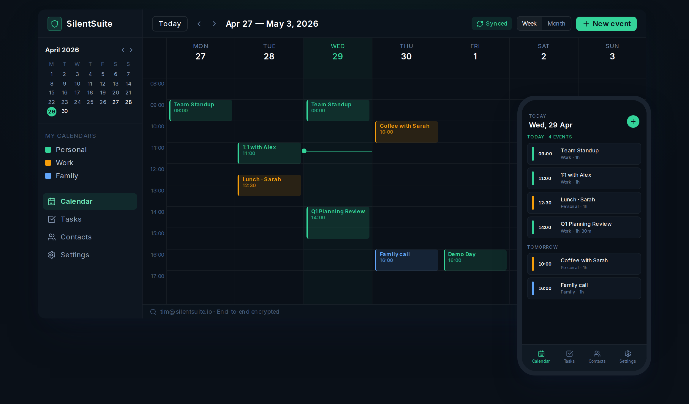
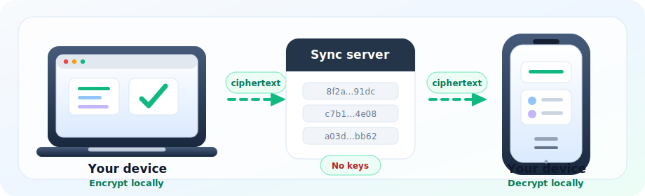

<div align="center">

# SilentSuite

**Privacy by Architecture.**

Open-source, zero-knowledge sync for calendars, contacts, and tasks.
Plaintext stays off the server; keys stay on-device.

[](./LICENSE)
[](https://github.com/silent-suite/silentsuite/releases)
[](https://github.com/silent-suite/silentsuite/stargazers)
[](https://x.com/silentsuiteio)

[Website](https://silentsuite.io) · [Docs](https://docs.silentsuite.io) · [Blog](https://silentsuite.io/blog)

<br />

<a href="https://silentsuite.io">
  
</a>

<br /><br />

[**Star this repo**](https://github.com/silent-suite/silentsuite/stargazers) · [Create your account](https://app.silentsuite.io/signup) · [Self-host](#self-host) · [Android APK](https://github.com/silent-suite/silentsuite/releases/latest) · [Help test](#help-test-the-beta)

Star the repo to follow the F-Droid and Google Play launch.

</div>

---

## What is SilentSuite?

SilentSuite is an end-to-end encrypted alternative to Google Calendar, iCloud, and other cloud sync services. Events, contacts, and tasks are encrypted before they reach the sync server.

- 📅 **Calendar:** encrypted events and reminders
- 👥 **Contacts:** encrypted address book sync
- ✅ **Tasks:** encrypted to-do lists
- 🔌 **Bridge:** local CalDAV/CardDAV for apps like Apple Calendar and Thunderbird
- 🤖 **Android:** signed APK syncs into Android calendar, contacts, and task providers

Built on the open [Etebase protocol](https://www.etebase.com/). Open source, self-hostable, EU-hosted for the managed service, GDPR-baseline.

## Why it exists

Most calendar and contact sync services can read the data they store. SilentSuite is built for people who want sync without handing over plaintext.

- **Zero-knowledge by default:** encryption is always on, with no opt-out mode
- **Open and auditable:** server, web app, bridge, and Android code are open source
- **No lock-in:** export your data, use standard clients through the bridge, or self-host
- **Practical beta:** usable today, but still honest about what is not ready yet

## Status

| Status | Details |
|---|---|
| **Available now** | Hosted web app, self-hosting, Android APK, CalDAV/CardDAV bridge, calendar/contact import-export, task export |
| **In progress** | F-Droid and Google Play listings, broader Android testing, DAV client compatibility reports |
| **Not in this beta** | Native iOS app, push notifications, shared calendars/contacts, OAuth Google/iCloud import |

If you are waiting for app-store availability, [star this repo](https://github.com/silent-suite/silentsuite/stargazers) to follow the F-Droid, Google Play, and release updates.

## How it works



Your device encrypts and decrypts locally. The sync server stores ciphertext and never receives your encryption keys. The CalDAV/CardDAV bridge only exposes plaintext on `localhost`, then syncs encrypted data upstream.

Hosted-service metadata is still visible where needed to operate the service: account and billing details, approximate encrypted storage size, sync timing, IP-level network logs, and operational metadata. Event titles, contact fields, task contents, notes, descriptions, locations, and reminders stay encrypted.

Crypto: XChaCha20-Poly1305, Argon2id, libsodium, and the open Etebase protocol.

## Get started

### Hosted service

Create an account at [app.silentsuite.io/signup](https://app.silentsuite.io/signup). Start with 7 days free without a card, or 30 days with a card; plans from €3/mo after trial.

### Android

Install the signed APK from [GitHub Releases](https://github.com/silent-suite/silentsuite/releases/latest), or add this repo to Obtainium for update notifications.

### Self-host

```bash
git clone https://github.com/silent-suite/silentsuite.git
cd silentsuite/self-host
cp .env.example .env   # then edit
docker compose up -d
```

Full setup guide: [Self-Hosting](./docs/self-hosting/).

## Help test the beta

Useful feedback right now:

- Android APK testing across device models and Android versions
- Bridge compatibility reports for Thunderbird, Apple Calendar, Evolution, GNOME Calendar, and other DAV clients
- Self-hosting verification on fresh servers
- Docs and trust review for vague privacy claims or confusing setup steps

Open a [GitHub issue](https://github.com/silent-suite/silentsuite/issues) with logs/screenshots where useful. Do not paste secrets, passwords, or private calendar/contact data.

## Docs

- [User Guide](./docs/user-guide/)
- [Self-Hosting](./docs/self-hosting/)
- [Contributing](./docs/contributing/)
- [docs.silentsuite.io](https://docs.silentsuite.io)

## Follow along

If SilentSuite is useful to you, [star this repo](https://github.com/silent-suite/silentsuite/stargazers). Stars help early testers, contributors, and privacy users find the project while F-Droid and Google Play are in progress.

<p align="center">
  <a href="https://github.com/silent-suite/silentsuite/stargazers">
    
  </a>
</p>

<a href="https://star-history.com/#silent-suite/silentsuite&Date">
  <picture>
    <source media="(prefers-color-scheme: dark)" srcset="https://api.star-history.com/svg?repos=silent-suite/silentsuite&type=Date&theme=dark" />
    <source media="(prefers-color-scheme: light)" srcset="https://api.star-history.com/svg?repos=silent-suite/silentsuite&type=Date" />
    
  </picture>
</a>

<details>
<summary><strong>Developer information</strong></summary>

### Run locally

```bash
git clone https://github.com/silent-suite/silentsuite.git
cd silentsuite
pnpm install
pnpm dev
```

The Etebase sync server, CalDAV/CardDAV bridge, and Android adapter each have their own setup. See the [Contributing guide](./docs/contributing/) for the full dev environment.

### Tech stack

| Component | Technology |
|-----------|-----------|
| Sync server | Python, Etebase protocol, Django |
| Web app | Next.js 15, React, Tailwind CSS |
| Docs site | VitePress, Vue, Cloudflare Workers |
| CalDAV/CardDAV bridge | Python, Radicale |
| Android adapter | Kotlin |
| Encryption | Etebase protocol, XChaCha20-Poly1305, Argon2id, libsodium |

### Repository structure

| Path | What it is |
|------|-----------|
| [`apps/web/`](./apps/web/) | Web app at app.silentsuite.io |
| [`apps/docs/`](./apps/docs/) | Documentation site |
| [`packages/`](./packages/) | Shared TypeScript packages |
| [`server/`](./server/) | Etebase sync server |
| [`bridge/`](./bridge/) | CalDAV/CardDAV bridge |
| [`android/`](./android/) | Android sync adapter |
| [`self-host/`](./self-host/) | Docker self-hosting setup |
| [`docs/`](./docs/) | Markdown documentation |

The marketing site and billing/accounts API live in a separate private repo and have no cryptographic responsibilities.

</details>

## License

[AGPL-3.0](./LICENSE) · [`android/LICENSE`](./android/LICENSE) (GPL-3.0)
