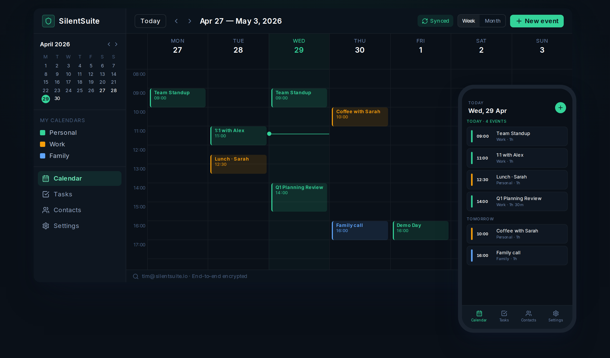
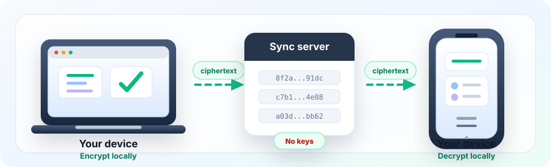

<div align="center">

<a href="https://silentsuite.io">
  
</a>

# SilentSuite

**Privacy by Architecture.**

Open-source, end-to-end encrypted sync for calendars, contacts, and tasks.
Plaintext stays off the server. Keys stay on your devices.

[](./LICENSE)
[](https://github.com/silent-suite/silentsuite/releases)
[](https://github.com/silent-suite/silentsuite/stargazers)
[](https://x.com/silentsuiteio)

[Website](https://silentsuite.io) · [Web app](https://app.silentsuite.io/signup) · [Docs](https://docs.silentsuite.io) · [Blog](https://silentsuite.io/blog) · [Android APK](https://github.com/silent-suite/silentsuite/releases/latest)

<br />

<a href="https://silentsuite.io">
  
</a>

<br /><br />

SilentSuite is in open beta. [Star the repo](https://github.com/silent-suite/silentsuite/stargazers) to help early testers find it, or jump straight to [helping test](#help-test-the-beta).

</div>

## What is SilentSuite?

SilentSuite is an end-to-end encrypted alternative to Google Calendar, iCloud, and other cloud sync services. Your events, contacts, and tasks are encrypted on your device before they ever reach the sync server, using the open [Etebase protocol](https://www.etebase.com/).

It syncs:

- 📅 **Calendars** with events and reminders
- 👥 **Contacts** across your devices
- ✅ **Tasks** and to-do lists

And it meets you where your apps are:

- 🌐 **Web app** at [app.silentsuite.io](https://app.silentsuite.io), with client-side encryption
- 🤖 **Android** via a signed APK that syncs into the system calendar, contacts, and task providers
- 🔌 **CalDAV/CardDAV bridge** so Apple Calendar, Thunderbird, Evolution, and other standard clients work over `localhost`
- 🍎 **iOS** through the open-source EteSync app, which speaks the same protocol, until a native app is ready
- 🏠 **Self-hosting** with a two-container Docker setup

## Why privacy matters here

Calendars and address books are some of the most sensitive data people put in the cloud: who you meet, when, where, and how to reach everyone you know. Most sync services can read all of it.

SilentSuite is built so the server operator, including us, cannot:

- **Zero-knowledge by default.** Encryption is always on. There is no unencrypted mode to misconfigure.
- **Open and auditable.** The server, web app, bridge, and Android code are all in this repository.
- **No lock-in.** Export your data, connect standard DAV clients through the bridge, or run the whole stack yourself.
- **Honest funding.** Paid hosting funds development. Sync contents are unreadable to us, so they cannot be monetised.

The managed service is EU-hosted and built to a GDPR baseline.

## How it works



Your devices encrypt and decrypt locally. The sync server stores ciphertext and never receives your encryption keys. The CalDAV/CardDAV bridge exposes plaintext only on `localhost`, then syncs encrypted data upstream.

Event titles, contact fields, task contents, notes, descriptions, locations, and reminders stay encrypted. What the hosted service can see is the operational metadata needed to run it: account and billing details, approximate encrypted storage size, sync timing, and IP-level network logs.

Under the hood: XChaCha20-Poly1305, Argon2id, libsodium, and the open Etebase protocol.

## Beta status

| Status | Details |
|---|---|
| **Available now** | Hosted web app, self-hosting, Android APK, CalDAV/CardDAV bridge, calendar/contact import-export, task export |
| **In progress** | F-Droid and Google Play listings, broader Android testing, DAV client compatibility reports |
| **Not in this beta** | Native iOS app, push notifications, shared calendars/contacts, OAuth Google/iCloud import |

## Get started

### Hosted service

Create an account at [app.silentsuite.io/signup](https://app.silentsuite.io/signup). Start with 7 days free without a card, or 30 days with a card; plans from €3/mo after the trial.

### Android

Install the signed APK from [GitHub Releases](https://github.com/silent-suite/silentsuite/releases/latest), or add this repo to Obtainium for update notifications.

### Desktop clients

Run the [CalDAV/CardDAV bridge](./bridge/) locally and point Apple Calendar, Thunderbird, or any other DAV client at it. See the [User Guide](./docs/user-guide/).

## Self-host

Run the sync server on your own hardware with Docker:

```bash
curl -fsSL https://raw.githubusercontent.com/silent-suite/silentsuite/main/self-host/install.sh | bash
```

The installer sets up two containers (the SilentSuite server and PostgreSQL), generates secrets, and writes your `.env`. You bring a reverse proxy for TLS. Prefer to read before you run? Clone the repo and start from [`self-host/SELF-HOSTING.md`](./self-host/SELF-HOSTING.md), or follow the [self-hosting docs](./docs/self-hosting/).

## Repository map

| Path | What it is |
|------|-----------|
| [`apps/web/`](./apps/web/) | Web app at app.silentsuite.io (Next.js, client-side encryption) |
| [`apps/docs/`](./apps/docs/) | Documentation site (VitePress) |
| [`packages/`](./packages/) | Shared TypeScript packages |
| [`server/`](./server/) | Sync server (Python, Etebase protocol) |
| [`bridge/`](./bridge/) | CalDAV/CardDAV bridge (Python, Radicale) |
| [`android/`](./android/) | Android sync adapter (Kotlin) |
| [`self-host/`](./self-host/) | Docker self-hosting setup |
| [`docs/`](./docs/) | Markdown documentation |

The marketing site and billing/accounts API live in a separate private repo and have no cryptographic responsibilities.

To run the web app locally:

```bash
git clone https://github.com/silent-suite/silentsuite.git
cd silentsuite
pnpm install
pnpm dev
```

The sync server, bridge, and Android adapter each have their own setup. See the [Contributing guide](./docs/contributing/) for the full dev environment.

## Help test the beta

The most useful feedback right now:

- Android APK testing across device models and Android versions
- Bridge compatibility reports for Thunderbird, Apple Calendar, Evolution, GNOME Calendar, and other DAV clients
- Self-hosting verification on fresh servers
- Web app translation proposals and review from fluent human translators, via [TRANSLATING.md](./TRANSLATING.md)
- Docs and trust review: call out vague privacy claims or confusing setup steps

Open a [GitHub issue](https://github.com/silent-suite/silentsuite/issues) with logs or screenshots where useful. Please do not paste secrets, passwords, or private calendar/contact data.

Want a small first PR? See the open [good first issues](https://github.com/silent-suite/silentsuite/issues?q=is%3Aissue%20is%3Aopen%20label%3A%22good%20first%20issue%22). Bug reports, feature requests, and PRs are all welcome.

More docs: [User Guide](./docs/user-guide/) · [Self-Hosting](./docs/self-hosting/) · [Contributing](./docs/contributing/) · [docs.silentsuite.io](https://docs.silentsuite.io)

## Security

If you find a security issue, please email <info@silentsuite.io> instead of opening a public issue.

## License

- [AGPL-3.0](./LICENSE) for the server, web app, bridge, and self-host code
- [GPL-3.0](./android/LICENSE) for the Android adapter, which builds on DAVx5 lineage
