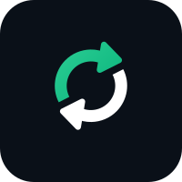
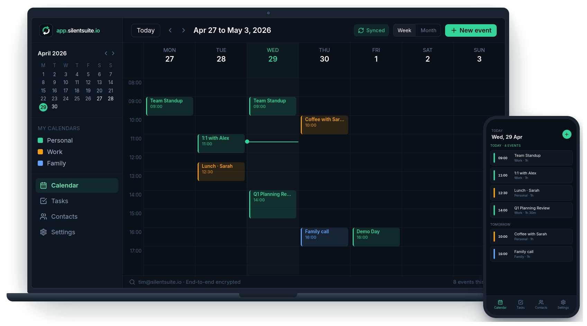
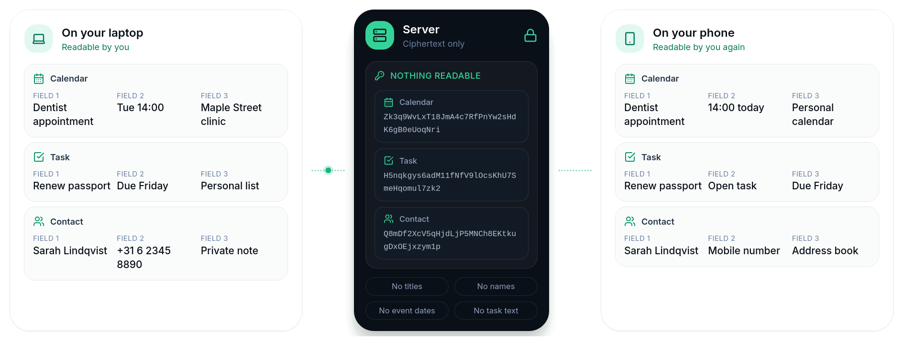

<div align="center">



# silentsuite.io

**Your calendar, tasks, and contacts. Private by design.**

Open-source, zero-knowledge sync. Plaintext stays off the server; encryption keys stay on trusted devices.

[](https://github.com/silent-suite/silentsuite/releases/latest)
[](./LICENSE)
[](https://github.com/silent-suite/silentsuite/stargazers)

[Website](https://silentsuite.io) · [Web app](https://app.silentsuite.io) · [Documentation](https://docs.silentsuite.io) · [Latest release](https://github.com/silent-suite/silentsuite/releases/latest)

<br />

<a href="https://silentsuite.io">
  
</a>

<br />

[**Get started for free**](https://app.silentsuite.io/signup) · [Get SilentSuite for Android](https://docs.silentsuite.io/user-guide/apps/android) · [Download the Bridge](https://github.com/silent-suite/silentsuite/releases/latest) · [Self-host](#self-host) · [Read the security model](https://silentsuite.io/security)

7 days without a card, or 30 days with a card. No charge during the trial.

</div>

---

## Private sync without a readable cloud copy

SilentSuite encrypts calendar events, contacts, and tasks on your device before syncing them. The hosted server stores ciphertext and does not receive the keys needed to read record contents.

| Surface | What works today |
|---|---|
| **Web** | Calendar, contact, and task management in the hosted web app |
| **Android** | Sync through Android's calendar, contacts, and task providers |
| **Desktop** | Local CalDAV/CardDAV Bridge for compatible calendar and address-book apps |
| **Self-hosting** | Open-source server deployment on infrastructure you control |
| **iOS** | On the roadmap, coming soon; the native app is in development, and EteSync for iOS is not a supported or working SilentSuite client |

Built on the open [Etebase protocol](https://www.etebase.com/) and the EteSync open-source lineage.

## Why these records deserve privacy

Calendars expose where you will be. Contacts map your relationships. Tasks reveal what you plan to do next. Conventional sync providers may be able to read those records after they reach the server.

SilentSuite takes a different approach:

- **Zero-knowledge record storage:** calendar, contact, and task contents reach the server as ciphertext.
- **Keys on trusted devices:** encryption and decryption happen client-side.
- **Open source:** inspect the server, web app, Android adapter, Bridge, and self-hosting code.
- **Practical exit paths:** export your data, use standard clients through the Bridge, or self-host.
- **No advertising model:** paid hosting funds the service rather than private-data monetisation.

## How it works



1. A trusted client derives and uses encryption keys locally.
2. Calendar, contact, and task records are encrypted before upload.
3. The sync server stores and distributes encrypted blobs.
4. Another trusted client downloads and decrypts the records locally.

The local Bridge exposes plaintext DAV only on `localhost`, then sends encrypted records upstream. Hosted operation still requires account, billing, storage-size, sync-timing, IP-level, and other operational metadata. Event titles, contact fields, task contents, notes, descriptions, locations, and reminders remain encrypted.

Cryptographic building blocks include XChaCha20-Poly1305, Argon2id, libsodium, and the Etebase protocol.

## Beta status

See the [latest public beta release](https://github.com/silent-suite/silentsuite/releases/latest) for current Android and Bridge binaries, checksums, and release notes.

| Status | Details |
|---|---|
| **Available now** | Hosted web app, self-hosting, Google Play, Obtainium, Zapstore, signed Android APK, desktop Bridge binaries, import/export, and GitHub Releases |
| **In progress** | Official F-Droid inclusion, broader Android testing, and more DAV compatibility reports |
| **Not in this beta** | Native iOS app, push notifications, shared or multiple collections, first-class encrypted notes, and OAuth-based Google/iCloud import |

The source is public for inspection, but SilentSuite has not yet completed an independent third-party security audit. See the [security page](https://silentsuite.io/security) for the threat model, limitations, and disclosure route.

## Get started

### Hosted service

[Create your account](https://app.silentsuite.io/signup) and choose either a 7-day no-card trial or a 30-day card-backed trial. Monthly and annual plans are available after the trial.

### Android and desktop Bridge

Install SilentSuite for Android through Google Play, Obtainium, Zapstore, or a
signed APK. The [Android installation guide](https://docs.silentsuite.io/user-guide/apps/android)
explains each channel and its update behavior. Official F-Droid inclusion is pending.

Download Bridge binaries and signed Android APKs with checksums from
[GitHub Releases](https://github.com/silent-suite/silentsuite/releases/latest).

- [Android setup](https://docs.silentsuite.io/user-guide/apps/android)
- [DAV Bridge setup](https://docs.silentsuite.io/user-guide/apps/dav-bridge)

### Self-host

```bash
git clone https://github.com/silent-suite/silentsuite.git
cd silentsuite/self-host
cp .env.example .env   # then edit
docker compose up -d
```

Full guide: [Self-host SilentSuite](./docs/self-hosting/)

## Help test and contribute

Useful contributions include:

- Android testing across device models and Android versions
- Bridge compatibility reports for Thunderbird, Apple Calendar, Evolution, GNOME Calendar, and other DAV clients
- Fresh-server self-hosting verification
- Translation proposals reviewed by fluent human speakers
- Documentation and privacy-claim review

Browse the open [good first issues](https://github.com/silent-suite/silentsuite/issues?q=is%3Aissue%20is%3Aopen%20label%3A%22good%20first%20issue%22), read the [contributing guide](./docs/contributing/), or open a [GitHub issue](https://github.com/silent-suite/silentsuite/issues).

Do not include passwords, recovery material, private calendar/contact data, or other secrets in reports. Send security disclosures to <info@silentsuite.io> rather than opening a public issue.

## Documentation

- [User guide](./docs/user-guide/)
- [Self-hosting](./docs/self-hosting/)
- [Contributing](./docs/contributing/)
- [Translating SilentSuite](./TRANSLATING.md)
- [Security model](https://silentsuite.io/security)
- [Hosted documentation](https://docs.silentsuite.io)

<details>
<summary><strong>Developer information</strong></summary>

### Run locally

```bash
git clone https://github.com/silent-suite/silentsuite.git
cd silentsuite
pnpm install
pnpm dev
```

The Etebase sync server, CalDAV/CardDAV Bridge, and Android adapter have separate setup requirements. See the [contributing guide](./docs/contributing/) for the complete development environment.

### Repository map

| Path | Purpose |
|---|---|
| [`apps/web/`](./apps/web/) | Hosted web client |
| [`apps/docs/`](./apps/docs/) | Documentation site |
| [`packages/`](./packages/) | Shared TypeScript packages |
| [`server/`](./server/) | Etebase sync server |
| [`bridge/`](./bridge/) | Local CalDAV/CardDAV Bridge |
| [`android/`](./android/) | Android sync adapter |
| [`self-host/`](./self-host/) | Docker self-hosting setup |
| [`docs/`](./docs/) | Project documentation |

The marketing site and hosted billing/accounts API live separately and have no cryptographic responsibilities.

</details>

## License

[AGPL-3.0-only](./LICENSE) · [`android/LICENSE`](./android/LICENSE) (GPL-3.0)

<div align="center">

[**Star the repo to follow beta releases and app-store updates**](https://github.com/silent-suite/silentsuite/stargazers)

</div>
