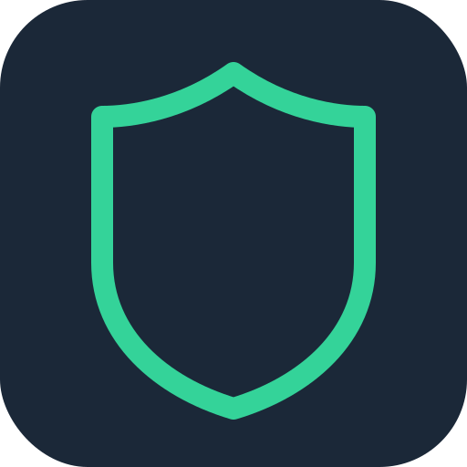

  
  <h1 align="center">SilentSuite - Secure Data Sync</h1>

Secure, end-to-end encrypted, and privacy respecting sync for your contacts, calendars and tasks (Android client).

# Overview

Please see the [SilentSuite website](https://silentsuite.io) for more information.

SilentSuite is licensed under the [GPLv3 License](LICENSE).

Based on [EteSync for Android](https://github.com/etesync/android) by Ricki Hirner / bitfire web engineering and Tom Hacohen. See [NOTICE](NOTICE) for full attribution.

# Building

SilentSuite uses `git-submodules`, so cloning the code requires slightly different commands.

1. Clone the repo: `git clone --recurse-submodules https://github.com/silent-suite/silentsuite`
2. Change to the directory `cd silentsuite-android`
3. Open with Android studio or build with gradle:
  1. Android studio (easier): `android-studio .`
  2. Gradle: `./gradlew assembleDebug`

To update the code to the latest version, run: `git pull --rebase --recurse-submodules`

Third Party Code
================

SilentSuite's source code was originally based on [EteSync for Android](https://github.com/etesync/android), which was itself based on [DAVdroid](https://www.davx5.com).

This project relies on many great third party libraries. Please take a look at the
app's about menu for more information about them and their licenses.
